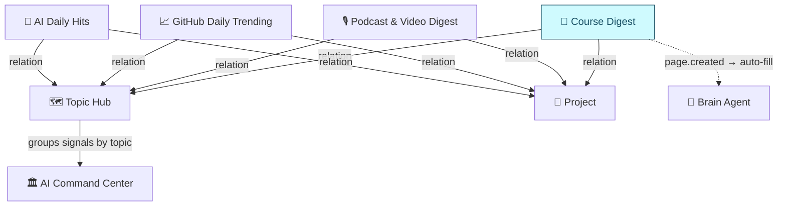

# 📖 Course Learning Workflow

A structured workflow for transforming passive course consumption into reflective, ecosystem-integrated learning. Built as the **4th source database** in the [AI Command Center](#) signal ecosystem, alongside AI Daily Hits, GitHub Daily Trending, and Podcast & Video Digest.

> **Status:** Phase 1 + 2 complete · Auditing (L2 pending)
> **Stage:** Beta · **Deploy Status:** Live
> **Parent project:** Creative Learning & Visualization Pipeline

---

## Why this exists

Online courses are **multi-module, sequential, and skill-building** — yet without a system, they get treated the same as one-off content (watch → forget). Courses become bookmarks, not capabilities.

This workflow plugs courses into a signal ecosystem so they produce:

1. **Module-by-module progress tracking** — not just done/not done
2. **Forced reflection at each module** — adapted from the Podcast Notebook pattern for cumulative learning
3. **Ecosystem integration** — course insights route to a Topic Hub, feed into Projects, and trigger a `🎨 Visualize → 📣 Project` publishing pipeline
4. **Agent-assisted processing** — auto-fill from URLs/syllabi, concept maps, comprehension Qs, application prompts

## What's in this repo

```
.
├── README.md                  ← you are here
├── CLAUDE.md                  ← Claude Code project instructions
├── AUTOMATION_SETUP.md        ← automation setup guide
├── docs/
│   ├── 01-problem-and-goal.md
│   ├── 02-architecture.md
│   ├── 03-delegation.md
│   ├── 04-constraints-risks.md
│   ├── 05-roadmap.md
│   ├── 06-open-questions.md
│   ├── 07-decision-log.md
│   ├── 08-retro.md
│   ├── 09-next-actions.md
│   └── 10-resources.md
├── schema/
│   └── course-digest.md       ← DB schema (19 properties)
├── templates/
│   └── course-notebook.md     ← modular template spec
├── agents/
│   └── brain-agent.md         ← auto-fill + learning expert role
└── automation/                ← Node.js CLI (Notion → Claude → Notion)
    ├── src/
    │   ├── index.js
    │   ├── notion.js
    │   ├── claude.js
    │   └── markdown-to-notion.js
    ├── package.json
    └── README.md
```

## Architecture at a glance



## Build-value call

> ✅ **Build.** Off-the-shelf course platforms track progress but don't integrate with the workspace signal ecosystem. The Podcast & Video Digest is a proven pattern — adapting it for structured course content adds unique value: module-level progress, structured reflection, full ecosystem integration (Topic Hub, shared vocabulary, two-toggle output flow, agent auto-fill).

## Status snapshot

| Phase | Status |
|---|---|
| Phase 1 — Storage layer + templates | ✅ Complete |
| Phase 2 — Refinements + validation | ✅ Complete (L2 pending) |
| L1 audit (process compliance) | ✅ Pass (S1–S5) |
| L2 audit (outcome validation) | ⏳ Pending — needs real course entry |

See [`docs/05-roadmap.md`](docs/05-roadmap.md) for the full roadmap and [`docs/08-retro.md`](docs/08-retro.md) for retro entries.

## Origin

This repo was migrated from a Notion working brief. The structure preserves the original §1–§12 brief sections as discrete docs so the build history, decision log, and retro entries remain auditable.

## License

MIT — see [`LICENSE`](LICENSE).
