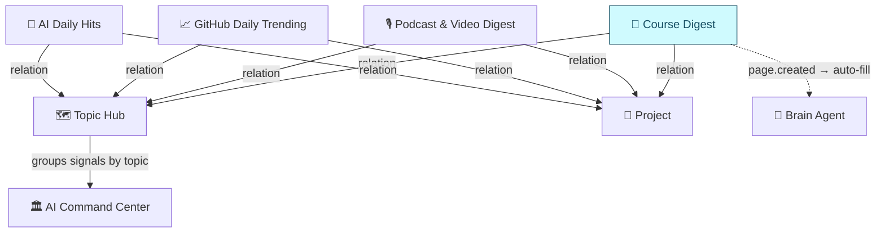

# 📖 Course Learning Workflow

> **Udemy knows you finished Module 4. It doesn't know you didn't understand it — and it has no way to connect it to anything you're building.**

A structured pipeline for turning course consumption into processed, workspace-integrated learning. Built as the **4th source database** in the AI Command Center signal ecosystem.

> **Status:** Phase 1 + 2 complete · L2 outcome validation pending

---

## The gap this fills

Online course platforms are good at one thing: tracking whether you watched.

| | Udemy | Datacamp | Coursera | This system |
|---|---|---|---|---|
| Completion tracking | ✅ | ✅ | ✅ | ✅ |
| Built-in quizzes | ❌ | ✅ | ✅ | via scaffolding |
| Cross-course synthesis | ❌ | ❌ | ❌ | ✅ Topic Hub |
| Workspace integration | ❌ | ❌ | ❌ | ✅ Projects + signals |
| Forced reflection | ❌ | ❌ | ❌ | ✅ per module |
| Learning-to-action routing | ❌ | ❌ | ❌ | ✅ → Projects DB |
| Your notes stay yours | ❌ | ❌ | ❌ | ✅ Notion |

**What platforms can't do:**
- Connect Module 4 of your ML course to the article you read last week on the same topic
- Route "I should build something with this" into an actual project
- Surface that two courses you took cover overlapping concepts
- Ask you whether you actually understood it, not just finished it

This system does all four. Courses become the same kind of signal as articles, podcasts, and GitHub repos — processed, tagged, related, and routed.

---

## How it works

```
Human adds course to Notion (URL + metadata)
        ↓
Brain Agent fires on page.created
        ↓
Scrapes URL → auto-fills properties + generates module notes
        ↓
Human processes each module:
  reads AI notes → works through comprehension Qs → writes reflection
        ↓
Human runs CLI (npm start) for deeper processing:
  uploads transcript/syllabus → single Claude API call
  → flat notes written back to Notion
        ↓
Course insight routes to:
  → Topic Hub (Category + Tags)
  → Projects DB (via relation)
  → Output pipeline (Visualize / Share)
```

**Cost:** ~$0.10/course (single Claude Sonnet 4.6 API call)

---

## Architecture

Three layers:

**Storage** — 📖 Course Digest, the 4th source DB in AI Command Center. 19 properties: 13 shared with all other source DBs (enabling Topic Hub aggregation) + 6 course-specific (Platform, Instructor, Modules, Progress, Difficulty, Goal).

**Agent** — Brain Agent extended for Course Digest. On `page.created`: scrapes URL, auto-fills properties, generates per-module notes + learning scaffolding (concept connections, comprehension questions, application prompts). Connects entries to Topic Hub by Category + Tags.

**Automation** — Node.js CLI (`npm start`). Human-triggered. Fetches unprocessed courses, accepts transcript PDF or context file, makes one Claude API call, writes flat blocks back to Notion, sets Status to Done.



---

## What's in this repo

```
.
├── README.md                  ← you are here
├── CLAUDE.md                  ← Claude Code project instructions
├── AUTOMATION_SETUP.md        ← automation setup guide
├── docs/
│   ├── 01-problem-and-goal.md
│   ├── 02-architecture.md
│   ├── 03-delegation.md
│   ├── 04-constraints-risks.md
│   ├── 05-roadmap.md
│   ├── 06-open-questions.md
│   ├── 07-decision-log.md
│   ├── 08-retro.md
│   ├── 09-next-actions.md
│   └── 10-resources.md
├── schema/
│   └── course-digest.md       ← DB schema (19 properties)
├── templates/
│   └── course-notebook.md     ← modular template spec
├── agents/
│   └── brain-agent.md         ← auto-fill + learning expert role
└── automation/                ← Node.js CLI (Notion → Claude → Notion)
    ├── src/
    │   ├── index.js
    │   ├── notion.js
    │   ├── claude.js
    │   └── markdown-to-notion.js
    ├── package.json
    └── README.md
```

---

## Status

| Phase | Status |
|---|---|
| Phase 1 — Storage layer + templates | ✅ Complete |
| Phase 2 — Refinements + validation | ✅ Complete (L2 pending) |
| L1 audit (process compliance) | ✅ Pass (S1–S5) |
| L2 audit (outcome validation) | ⏳ Pending — needs real course entry |

---

## License

MIT — see [`LICENSE`](LICENSE).
