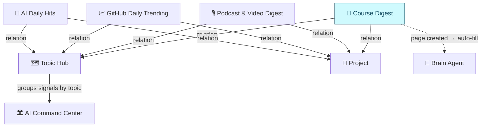

# §4 · Architecture

## Storage layer

- **New database: 📖 Course Digest** — 4th source DB in AI Command Center, following Pattern 1
- **Shared properties** (identical to other 3 source DBs): Title, URL, Date, Core Insight, Why It Matters, Category, Tags, Eval Metric, Action, Output, Status, Project (→ Projects DB), Topic Hub (two-way relation)
- **Course-specific properties:**
  - `Platform` — Select (Coursera, Udemy, YouTube, edX, Stanford Online, MIT OCW, Fast.ai, Other)
  - `Instructor` — Text
  - `Modules` — Number (total module count)
  - `Progress` — Number (modules *processed* — reflected on, not just watched)
  - `Difficulty` — Select (Beginner / Intermediate / Advanced) — **course-only**
  - `Goal` — Text (why this course was added; what skill or outcome is expected)
- **Templates:** Single modular template (📖 Course Notebook) with composable sections — "Add Module" pattern inserts toggle sections on demand. Self-scaling: works for 3-module tutorials and 30-module courses without a separate template.

## Agent layer

**Brain Agent** — extend existing (no new agent):

- Add 📖 Course Digest to read/write access
- Add `User Entry Auto-Fill` trigger on `page.created`
- **URL-first workflow:** On page creation, scrape the course URL via web access → extract title, description, syllabus/module list, instructor, difficulty. Auto-fill all properties + generate module notes with rationales.
- **Fallback:** If URL scrape is thin (login-gated platform), fill what's available and flag in page body: *"Syllabus incomplete — paste full outline for deeper module notes."* Human pastes outline → re-triggers full auto-fill.
- Topic Hub sync: same rules as other source DBs
- **Learning expert role:** Beyond auto-fill, provide learning scaffolding — concept connections across modules, comprehension questions, application prompts, spaced repetition cues. Connects to Creative Learning & Visualization Pipeline.

## Automation layer

- `page.created` trigger → Brain Agent auto-fill (same as Podcast Digest)
- No recurring trigger — courses are manually added

**Manual CLI (`automation/`)** — Node.js tool for Notion → Claude → Notion pipeline:
- Human runs `npm start`; tool fetches non-Done courses from the database
- User selects a course, optionally uploads transcript PDF or context file
- Single Claude API call (Sonnet 4.6, 8096 max tokens) generates module notes + scaffolding in Markdown
- Markdown converts to flat Notion blocks (heading_2 per module, heading_3 for sections, bullets/paragraphs flat)
- Results written back to Notion; Status set to Done
- Cost: ~$0.06–0.15 per course depending on module count

## Shared vocabulary

No new options needed. `Platform` is course-specific only (like `Source` on Podcast, `Language` on GitHub).

## Diagram

> 🛠️ **Build order:** Schema → views → Topic Hub relation → Projects relation → Templates → Brain Agent update → Shared vocabulary audit
